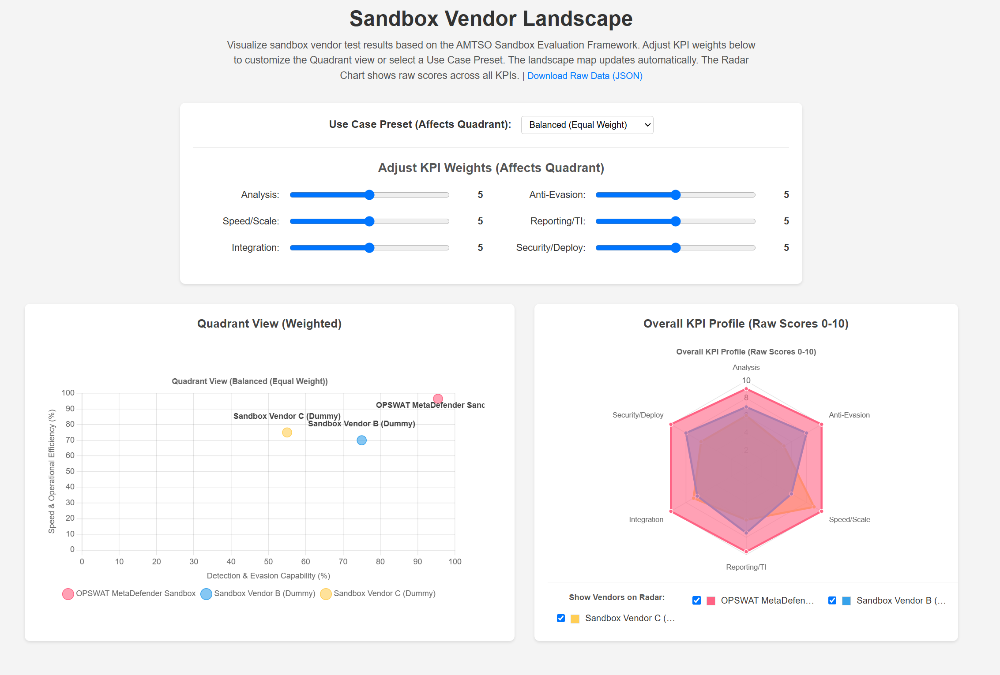

# Sandbox Vendor Landscape Visualization Tool

## Introduction

This web application provides an interactive way to visualize and compare sandbox vendor performance based on test results conforming to the **AMTSO Sandbox Evaluation Framework**. It allows users to explore how different vendors position themselves based on various Key Performance Indicators (KPIs) and weighting profiles relevant to specific cybersecurity use cases.

The goal is to offer a transparent and flexible tool for SOC analysts, malware researchers, security managers, and other stakeholders evaluating sandbox solutions.



## Features

* **Quadrant Chart View:** Displays vendors on a 2D scatter plot based on weighted scores derived from selected KPIs. Default axes represent "Detection & Evasion Capability" vs. "Speed & Operational Efficiency".
* **Radar Chart View:** Shows the raw performance profile (scores 0-10) of selected vendors across all 6 core AMTSO KPIs simultaneously.
* **Interactive KPI Weighting:** Adjust the importance (weight, 0-10) of each of the 6 AMTSO KPIs using sliders to see how vendor positions change dynamically on the Quadrant chart.
* **Use Case Presets:** Select predefined weighting profiles based on common use cases defined in the AMTSO framework (e.g., Zero-Day Detection, Large-Scale Processing) to automatically set the KPI sliders.
* **Radar Vendor Filtering:** Select specific vendors via checkboxes to compare their raw performance profiles on the Radar chart, reducing clutter.
* **Detailed Tooltips:** Hover over data points on the Quadrant chart to see vendor name, calculated coordinates, test date, and key metrics like FP/FN rates and average processing speed (if available in the source data).
* **Vendor-Specific Coloring:** Consistent colors are assigned to each vendor across both charts and the radar filter controls.
* **Data Labels:** Vendor names are displayed directly on the Quadrant chart for easy identification.
* **Raw Data Download:** Provides a link to download the complete, original `results.json` data file used by the application, ensuring full transparency.

## Technology Stack

* **Backend:** Python 3, Flask
* **Frontend:** HTML5, CSS3, JavaScript (ES6+)
* **Charting Library:** Chart.js with the `chartjs-plugin-datalabels` plugin

## Project Structure

```
sandbox-landscape-tool/
├── app.py             # Flask application logic and API endpoints
├── data/
│   └── results.json   # Vendor test results data (MUST BE CREATED MANUALLY)
├── static/
│   ├── css/
│   │   └── style.css  # CSS styles
│   └── js/
│       └── app.js     # Frontend JavaScript logic (Chart.js interaction)
└── templates/
    ├── index.html     # Main HTML page template
    └── error.html     # Simple error page template
```

## Setup and Running

1.  **Clone Repository:** (If applicable)
    ```bash
    git clone <repository-url>
    cd sandbox-landscape-tool
    ```
2.  **Install Dependencies:** Ensure you have Python 3 installed. Install Flask:
    ```bash
    pip install Flask
    ```
3.  **Prepare Data:**
    * Create the `data` directory if it doesn't exist: `mkdir data`
    * Create a file named `results.json` inside the `data` directory.
    * Populate `data/results.json` with vendor test data conforming to the expected JSON schema (see Data Format section below). *The application will NOT run without this file.*
4.  **Run the Application:**
    ```bash
    python app.py
    ```
5.  **Access:** Open your web browser and navigate to `http://127.0.0.1:5001` (or the address provided in the console output).

## Data Format (`data/results.json`)

The application expects the `data/results.json` file to contain a JSON **list** of objects. Each object represents a single vendor's test result and should ideally conform to the following structure (based on the AMTSO framework and our tool's needs):

```json
[
  {
    "testMetadata": {
      "testID": "unique-test-run-id", // Optional but recommended
      "testDate": "YYYY-MM-DD",       // Used in tooltips
      "testerInfo": {                 // Optional
        "name": "Testing Organization Name",
        "contact": "contact@tester.example"
      },
      "vendorName": "Vendor Name Here", // Required
      "vendorWebsite": "[https://vendor.example](https://vendor.example)", // Optional
      "vendorContactEmail": "contact@vendor.example", // Optional
      "productVersion": "Product Version Tested", // Optional
      "useCasesTested": ["Use Case 1", "Use Case 2"], // Optional list
      "sampleSetDetails": { // Optional
        "description": "Details about samples...",
        "size": 100,
        "benchmarkToolsUsed": ["Tool A", "Tool B"]
      },
      "frameworkVersion": "1.0", // Optional
      "additionalNotes": "Any relevant notes..." // Optional
    },
    "kpiScores": { // Required - Scores 0-10
      "analysisCapability": 9.1,
      "antiEvasionTechnology": 10.0,
      "speedThroughputScale": 10.0,
      "reportingThreatIntelligence": 9.7,
      "integrationsAutomation": 10.0,
      "securityDeploymentMaintenance": 10.0
    },
    "keyPerformanceMetrics": { // Optional - Used in tooltips
      "falsePositiveRatePercent": 9.0,
      "falseNegativeRatePercent": 9.0,
      "averageProcessingTimeSeconds": 8.2
    }
  },
  // ... more vendor objects
]
```

* `testMetadata.vendorName` and `kpiScores` (with all 6 KPIs) are essential for the application to function correctly.
* `testMetadata.testDate` is used in tooltips.
* `keyPerformanceMetrics` are used in tooltips if present.

## Acknowledgements

* This tool visualizes data based on the concepts and Key Performance Indicators defined in the **AMTSO Sandbox Evaluation Framework**. Our thanks to the Anti-Malware Testing Standards Organization (AMTSO) and its members for their work in standardizing security testing.
* The framework document used as a reference can be found here: https://www.amtso.org/wp-content/uploads/2025/03/AMTSO-Sandbox-Evaluation-Framework_FINAL_2025-03.pdf
* We acknowledge the contributions of the framework authors listed in the document:

    * Jan Miller (Lead Author) - OPSWAT
    * Ralf Hund - VMRay
    * Andrey Voitenko - VMRay
    * Nima Bagheri - Venak Security
    * Kagan Isildak - Malwation

## Future Enhancements

* User-selectable KPIs for Quadrant chart axes.
* Dynamic Quadrant axes based on selected Use Case Preset.
* Database integration for storing and managing test results.
* Web interface for uploading new results.json data.
* More sophisticated normalization options (e.g., dataset min/max based
